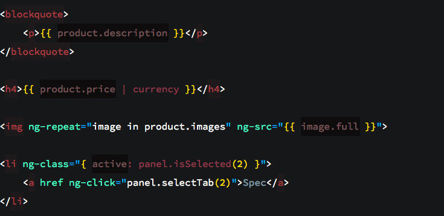

# Seti_UX

[](https://packagecontrol.io/packages/Seti_UX/)
[](https://github.com/ctf0/Seti_UX/releases/latest/)
[](https://github.com/ctf0/Seti_UX/issues?utf8=✓&q=is%3Aissue+is%3Aopen)
[](https://github.com/ctf0/Seti_UX/watchers/)
[](https://github.com/ctf0/Seti_UX/stargazers/)
[](https://github.com/ctf0/Seti_UX/network/)

Seti Improved Scheme/Syntax-HL for ST.

## Supported Syntax

```text
SublimeLinter
GitGutter
MarkDown (& MarkDown Extended)
diff
plist
MakeFile
Ruby
Python
JSON, XML
JS (& JavaScriptNext), Coffee, AngularJs (partial support)
Html (& Html5), Jade
Css (& Css3), Less, Sass/Scss
PHP, Laravel Blade, SQL
```

## Extended Support

Check [ctf0/Seti_UX#2](https://github.com/ctf0/Seti_UX/issues/2).

## Previews

**HTML**


**CSS3**


**JS** (work in progress)


**Angular** (work in progress)



**LESS** (Sass/Scss are similar)


**BLADE**


**PHP**


**DIFF**


**JADE**


**PYTHON**


**MARKDOWN**


**JSON** (up-to 19 level)


**XML**


**PLIST**


## ToDO

* [ ] Better support for AngularJs (need some help with regex for scopes).
* [ ] Better support for Sass/Scss. (we need a better syntax definition ,more like "Less" ).
* [ ] Better support for Python.
