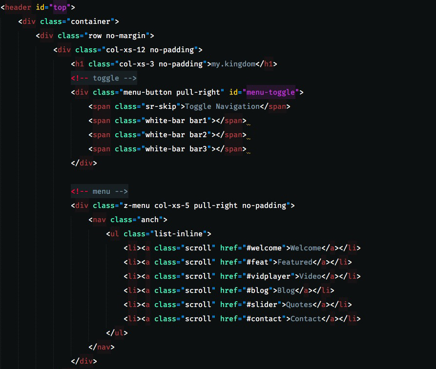
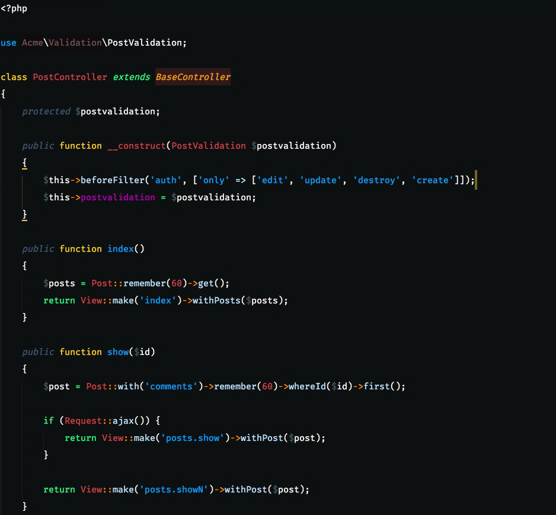
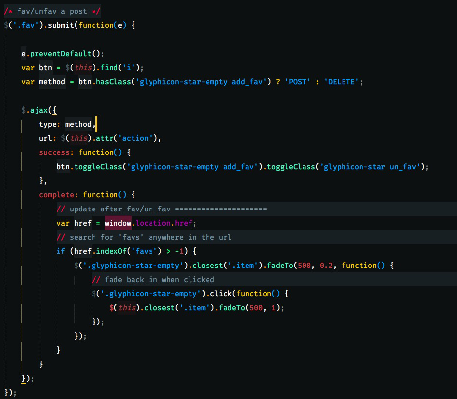

<h1 align="center" style="border: none">
    Seti_UX
     
    
</h1>

Seti Improved Scheme/Syntax-HL for ST.

## Ports

* [JetBrains](https://github.com/zchee/Seti_JetBrains) thanks to [@zchee](https://github.com/zchee)
* [iTerm](https://github.com/ginfuru/iTerm-Seti_UX) thanks to [@ginfuru](https://github.com/ginfuru)
* [Terminal](https://github.com/ginfuru/iTerm-Seti_UX) thanks to [@ginfuru](https://github.com/ginfuru)
* [HyperTerminal](https://github.com/ginfuru/iTerm-Seti_UX) thanks to [@ginfuru](https://github.com/ginfuru)

## Previews

**HTML**

**PHP**

**JS**

