# Seti_UX

Seti Improved Scheme/Syntax-HL for ST.

### Supported Syntax
```
SublimeLinter
GitGutter
MarkDown
diff
plist
Python
JSON, XML
JS (& JavaScriptNext), Coffee
Html, Jade
Css, Less, Sass/Scss
PHP, Laravel Blade, SQL
```

### Notes

- i only use like half of the above so if you have an ideas for Improvements please issue a ticket (preferably with a Screen-Shot).

- plz check [#2](https://github.com/ctf0/Seti_UX/issues/2).

## Previews

**HTML**


**CSS**

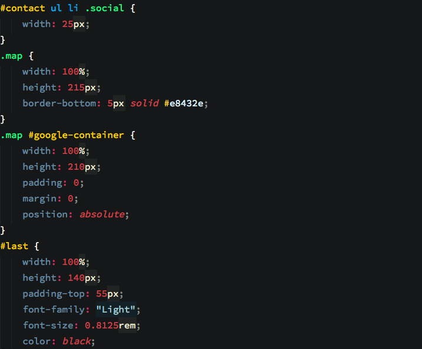

**JS** (work in progress)

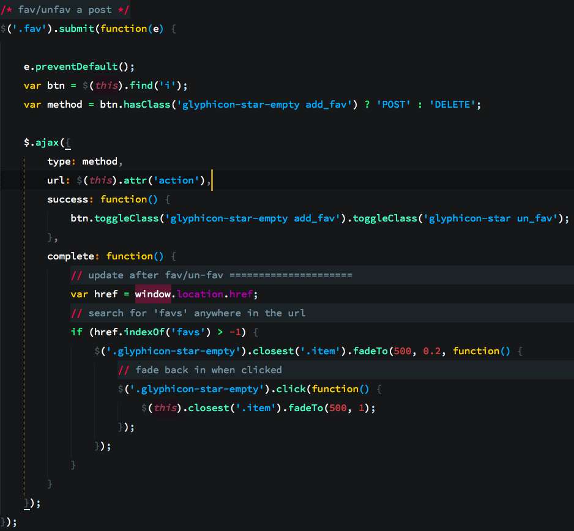

**LESS** (Sass/Scss are similar)

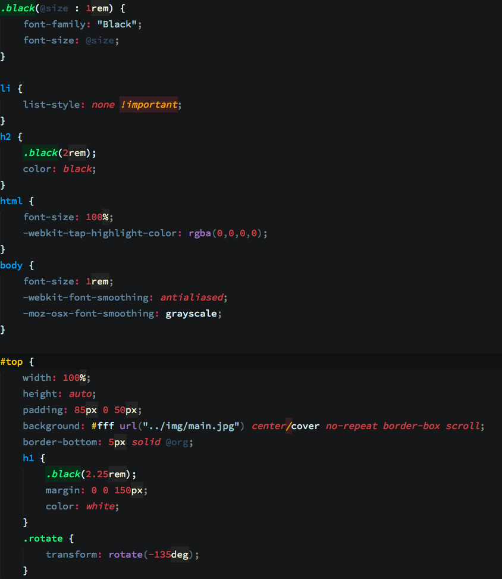

**BLADE**

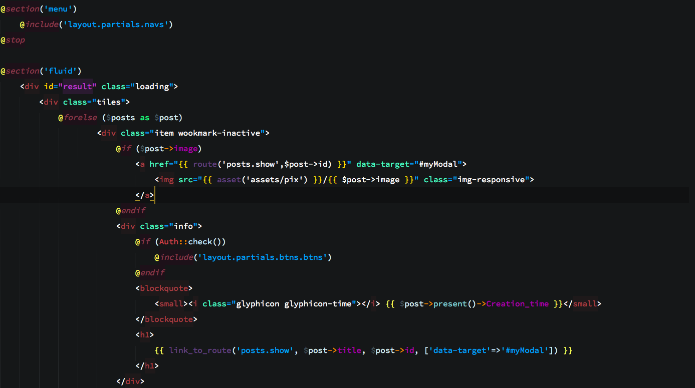

**PHP**

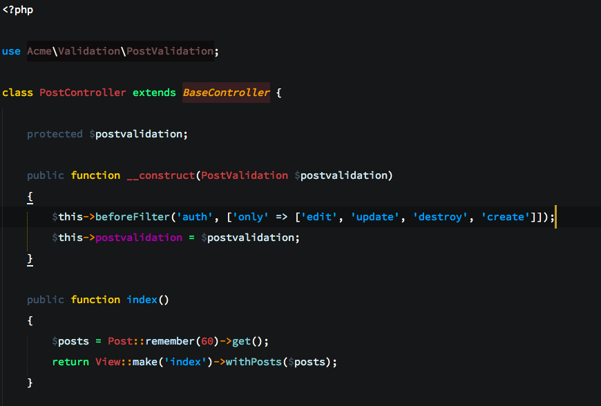

**DIFF**

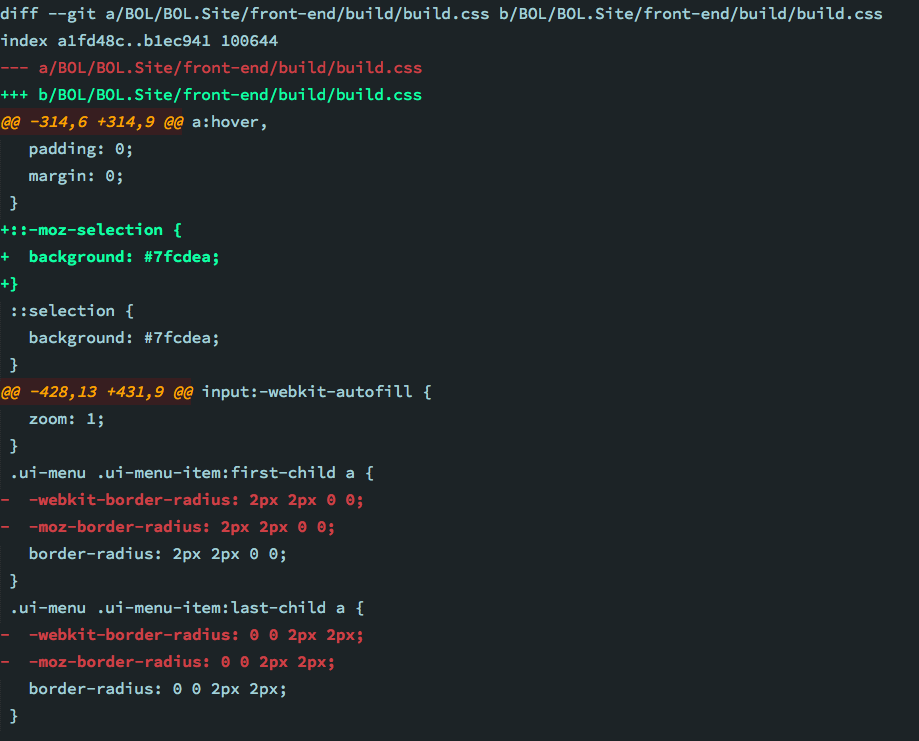

**JADE**

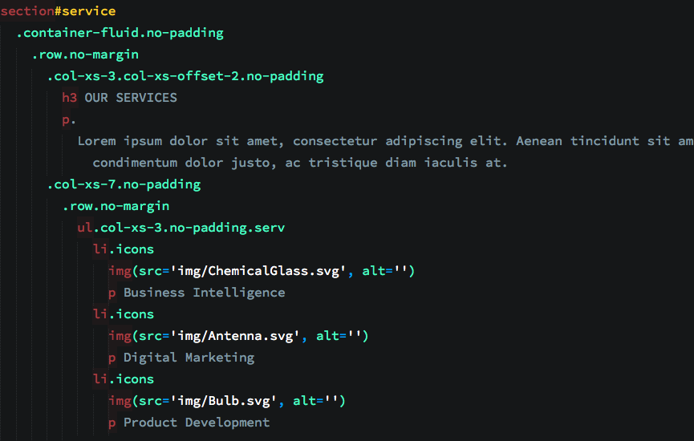

**PYTHON**

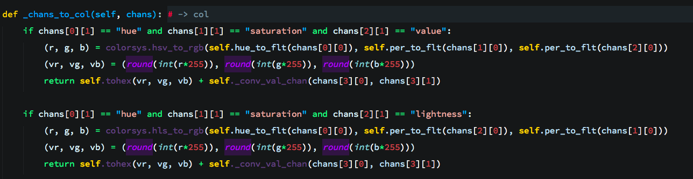

**MARKDOWN**

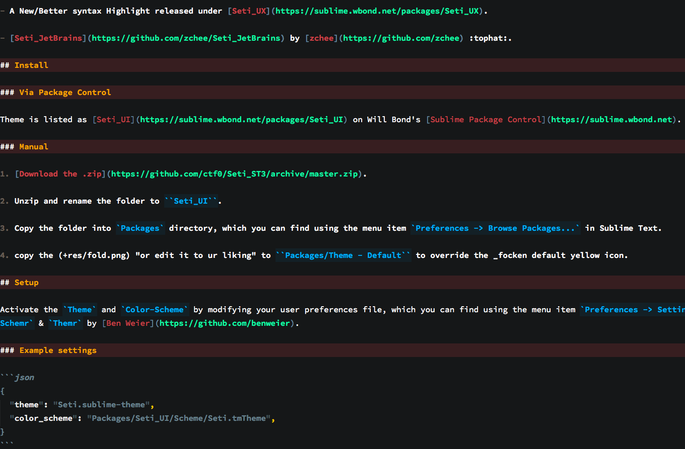

**JSON** (up-to 13 level)

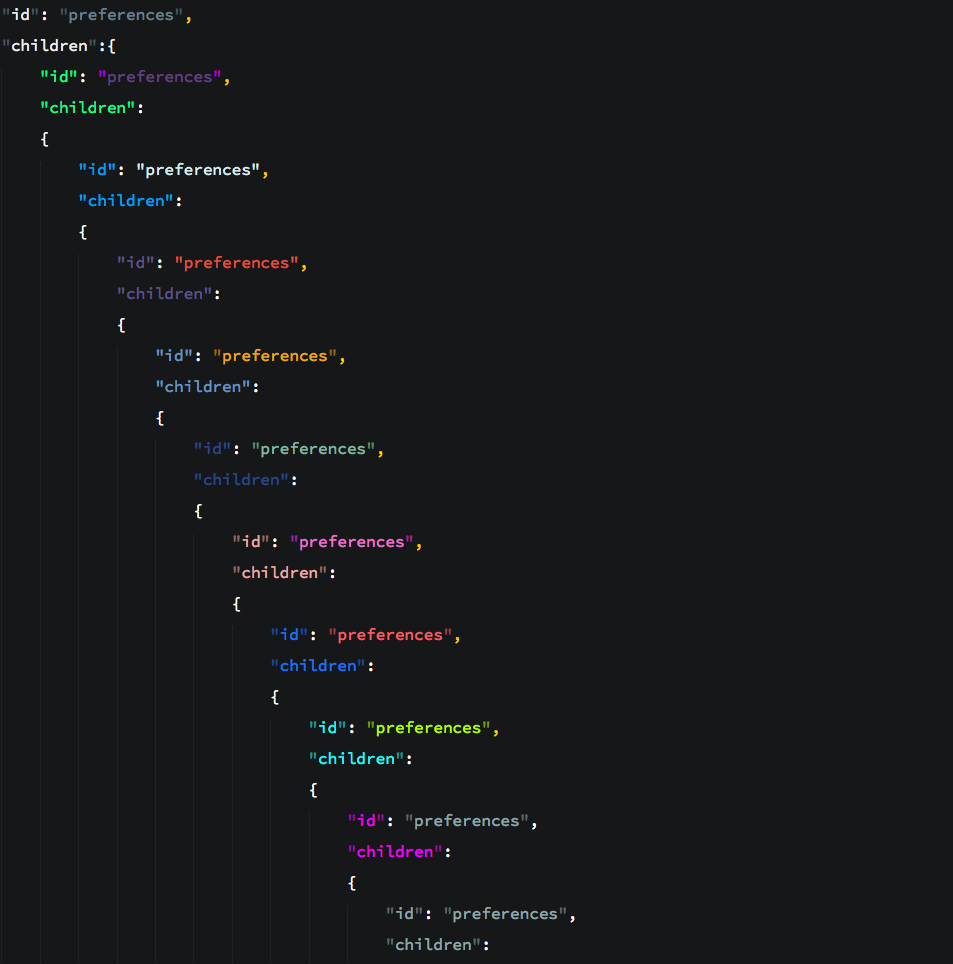

**XML**

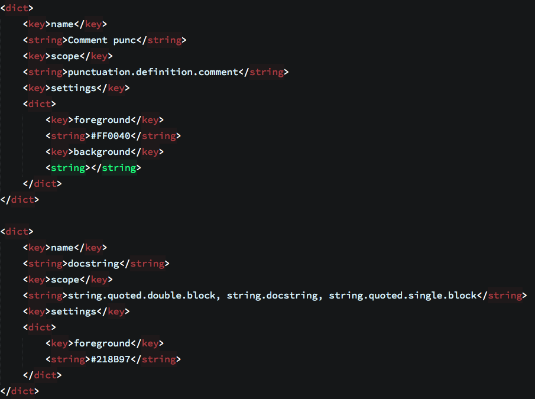

**PLIST**

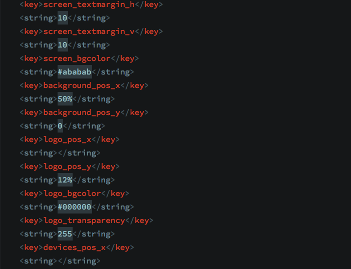


## ToDO

1. Better support for AngularJs.

2. Better support for Sass/Scss. (we need a better syntax definition ,more like "Less" ).

3. Better support for Python.

4. Cleanup the scheme file and make it smaller.
